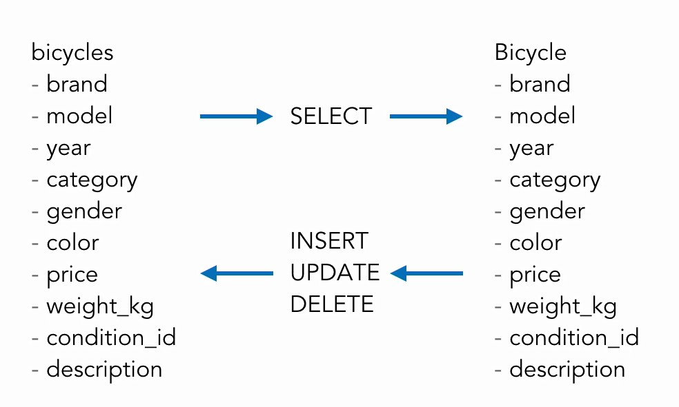
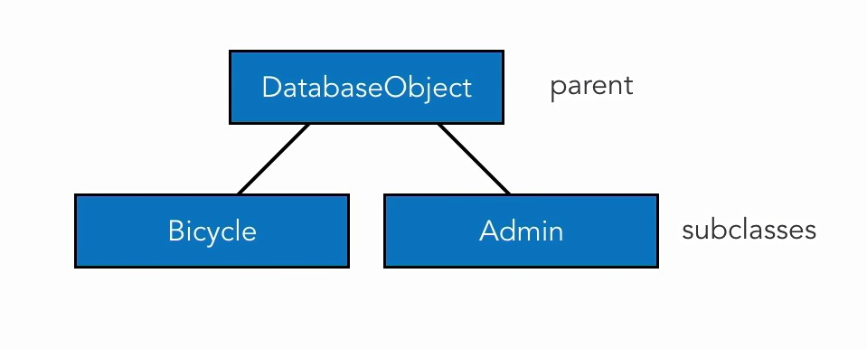

## 05. Create DB

```sql

CREATE DATABASE chain_gang;

SHOW DATABASES;

GRANT ALL PRIVILEGES ON chain_gang.* TO 'webuser'@'localhost' IDENTIFIED BY 'secretpassword';

USE chain_gang;
```

## 06. Create Table

```sql

CREATE TABLE bicycles (
    id INT(11) AUTO_INCREMENT PRIMARY KEY, 
    brand VARCHAR(255) NOT NULL, 
    model VARCHAR(255) NOT NULL, 
    year INT(4) NOT NULL,
    category VARCHAR(255) NOT NULL, 
    gender VARCHAR(255) NOT NULL, 
    color VARCHAR(255) NOT NULL, 
    price DECIMAL(9,2) NOT NULL, 
    weight_kg DECIMAL(9,5) NOT NULL, 
    condition_id TINYINT(3) NOT NULL, 
    description TEXT NOT NULL
);

SHOW TABLES;

SHOW FIELDS FROM bicycles;

INSERT INTO bicycles (brand, model, year, category, gender, color, price, weight_kg, condition_id, description) VALUES ('Trek','Emonda','2017','Hybrid','Unisex','black','1495.00','1.5','5','');

INSERT INTO bicycles (brand, model, year, category, gender, color, price, weight_kg, condition_id, description) VALUES ('Cannondale','Synapse','2016','Road','Unisex','matte black','1999.00','1.0','5','');

SELECT * FROM bicycles;

exit

```

## 10. MySQLi methods and properties

Аналоги у процедурного стиля и ООП

```php
// процедурный
OOP

// $db = mysqli_connect($server,$user,$pwd,$db_name);
$db = new mysqli($server, $user, $pwd, $db_name);

// mysqli_query($db, $sql)
$db->query($sql);

// mysqli_real_escape_string($db, $string)
$db->escape_string($string);

// mysqli_affected_rows($db)
$db->affected_rows;

// mysqli_insert_id($db) 
$db->insert_id;
```

```php
// $db - становится объектом,
// свойства и методы которого используются в дальнейшем коде
$db = new mysqli($server, $user, $pwd, $db_name); 
// $result - тоже становится объектом
$result = $db->query($sql);

// mysqli_fetch_assoc($result)
$result->fetch_assoc();

// mysqli_free_result($result)
$result->free();

// mysqli_num_rows($result)
$result->num_rows;
```

```php

$result->fetch_assoc();  // associative array
$result->fetch_row();    // basic array
$result->fetch_array();  // assoc, row, or both
$result->fetch_object(); // crude object
```

Из возможных методов `fetch_..()` всё же лучше использовать метод получения массива, чем метод получения объекта. Из полученного массива можно создавать свои объекты.  

## 12. Disconnect from the database

```php
$db = new mysqli($server, $user, $pwd, $db_name); 
$result = $db->query($sql);

// mysqli_close($db)
$db->close()
```

## 13. Active record design patterns

Суть в том, что столбцы записи в таблице соответствуют свойствам объекта в коде.  
При SELECT эти записи достаются из БД и заполняют свойства объекта.  
При INSERT, UPDATE, DELETE свойства объекта записываются в соответсвующие столбцы записи в таблице.  



## 19.CRUD operations

Примеры SQL

```sql
INSERT INTO bicycles (brand, model, year) 
VALUES ('Trek', 'Emonda', '2017');

UPDATE bicycles
SET brand='Trek', model='Emonda', year='2017' 
WHERE id='1' LIMIT 1;

DELETE FROM bicycles 
WHERE id='1' LIMIT 1;
```

## 25. HTML forms for OOP

Методика, как извлекать значения из HTML-формы.

Как было. Извлечение единичных значений.

```php

<input type="text" name="brand" value="" />
<input type="text" name="model" value="" /> 
<input type="text" name="year" value="" />

$args = [];
$args['brand'] = $_POST['brand']; 
$args['model'] = $_POST['model'];
$args['year'] = $_POST['year'];

$bicycle = new Bicycle($args);
```

Как можно. Извлечение массива.

```php

<input type="text" name="bicycle[brand]" value="" />
<input type="text" name="bicycle[model]" value="" /> 
<input type="text" name="bicycle[year]" value="" />

$args = $_POST['bicycle']; 

$bicycle = new Bicycle($args);
```

##  26. Validations and errors

Принцип валидации:

```php

$errors = [];

// Validations
if (is_blank($name)) {
    $errors[] = "Name cannot be blank.";
}

if (!empty($errors)) {
// don't save record, show errors instead
}

```

## 27. Delete a record

SQL:

    DELETE FROM bicycles
    WHERE id='1' LIMIT 1;

## 28. Create inheritable code



## 29. Admin class

Создание таблицы

```sql

CREATE TABLE admins (
  id INT (11) AUTO_INCREMENT PRIMARY KEY,
  first_name VARCHAR(255) NOT NULL,
  last_name VARCHAR(255) NOT NULL,
  email VARCHAR(255) NOT NULL,
  username VARCHAR(255) NOT NULL,
  hashed_password VARCHAR(255) NOT NULL
);
   
ALTER TABLE admins ADD INDEX index_username (username);
```

MySQL вход

    mysql -u root -p chain_gang

После создания таблицы

    SHOW TABLES; 
    SHOW FIELDS FROM admins;

Выход

    quit

## 